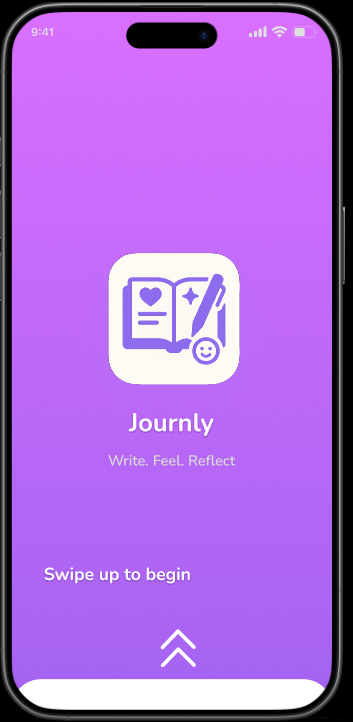
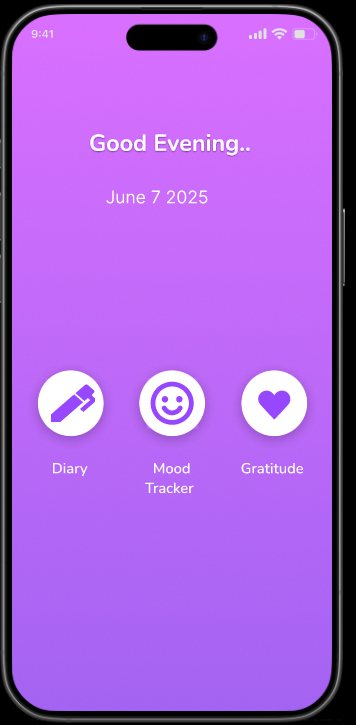
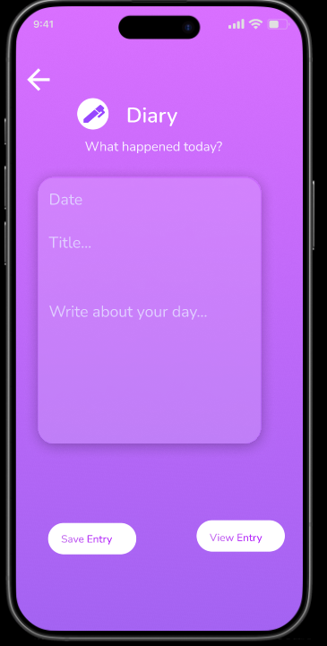
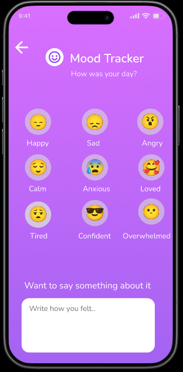
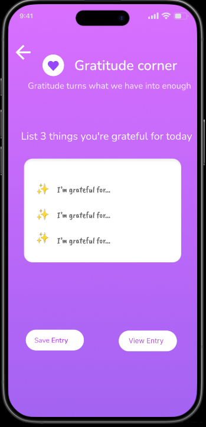

# 📔 Journly — A Guided Journal & Mood Tracker UI

**Journly** is a calming and minimal mobile app UI design for emotional wellness. It offers users a space to reflect, track their mood, and practice daily gratitude—all in one smooth and clutter-free interface. Designed in **Figma**, Journly is ideal for users seeking mindfulness, emotional clarity, and digital wellness.

---

## ✨ Features

### 📓 Diary
- Add daily entries with titles and personal reflections.
- View previous logs as scrollable cards with date and title.
- Includes a search bar and date filter icon for easy navigation.
- Animated feedback on saving entries (spinner → tick → confirmation).

### 😊 Mood Tracker
- Choose from 9 emotion emojis to log how you feel.
- Emojis glow and scale on selection, giving a visual cue.
- Optional text input to express more about your emotional state.
- Only one emoji can be selected at a time for clarity.

### 🙏 Gratitude Corner
- Inspirational quote displayed at the top to encourage reflection.
- Prompts user to list 3 things they are grateful for today.
- Input fields styled with subtle visuals for a paper-like experience.
- Includes Save and View Entry options to store reflections.

---

## 📱 Screens Included

1. Splash Screen (with logo, animation, and swipe up arrows)
2. Home Page
3. Diary Entry Page
4. Mood Tracker Page
5. Gratitude Corner Page
6. Save Confirmation Flow
7. View Journal Entry Page
---

## 🔗 Figma File

[View on Figma](https://www.figma.com/design/16LWhqW7LezGrUpa7AjMlE/journly-app?node-id=0-1&t=XZuBEV0kY5eTPydX-1) 
> 

---

## 🛠️ Tools Used

- **Figma** – for designing UI layouts, animations, and interactions
- **Figma Plugins**:
  - Emoji plugin – for mood emojis
  - Iconify – for icons
  - LottieFiles – for any animations (if used)

---

## 📸 Preview

### Splash Screen  

### Home Screen

### Diary Screen

### Mood Tracker screen

### Gratitude Screen

---

## 📌 Notes

- This project is focused on **UI design only**, not yet connected to backend or database.
- Suitable for use in portfolio projects or as a UI kit for wellness-based apps.
- You can further extend this with dark mode, reminders, or voice journaling.

---

## 👩‍🎨 Designed by

**[Lithika]**  
A calming space to write. feel. reflect.

---

